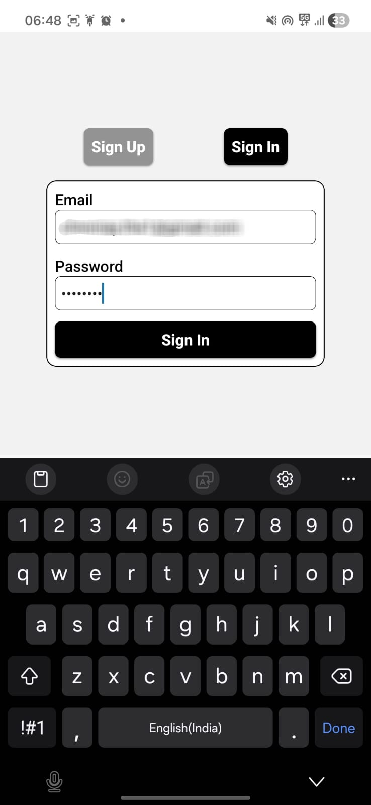
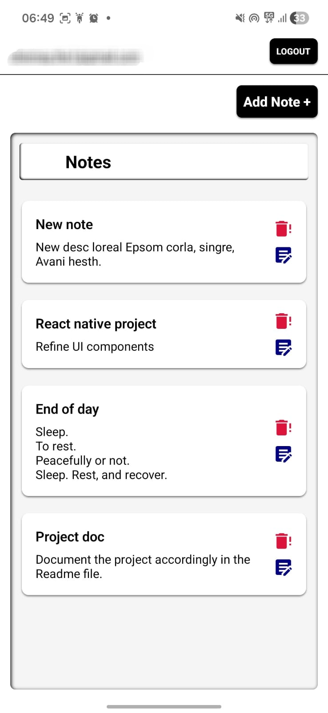
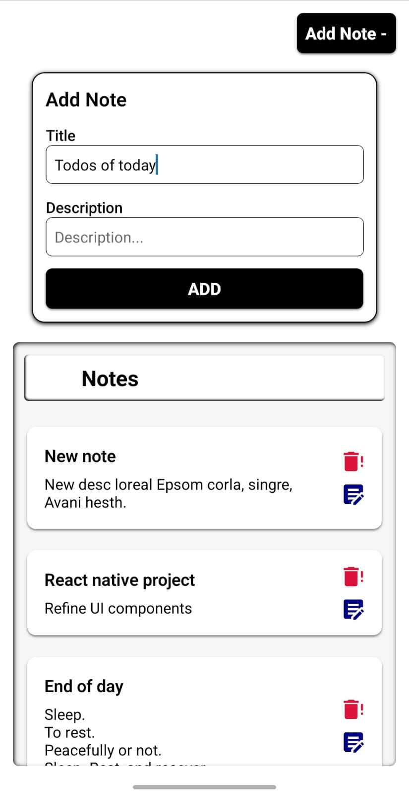
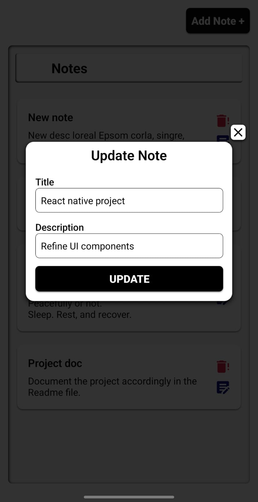
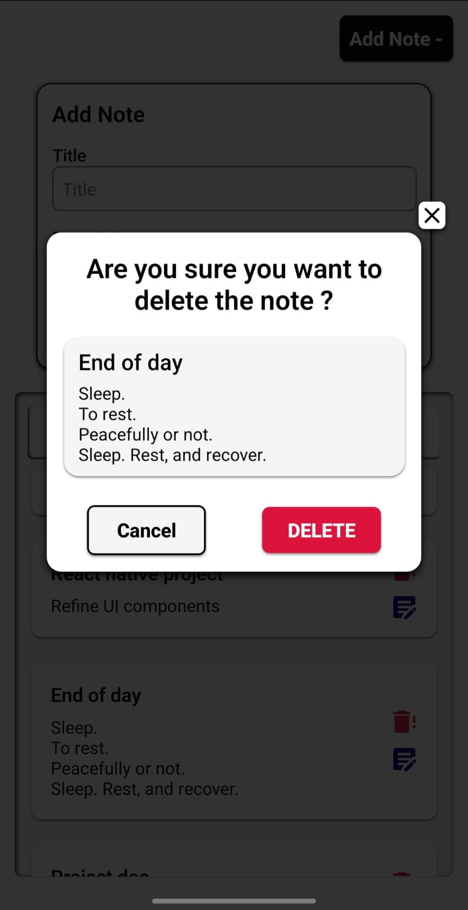

# 📝 Simple Notes App

A modern Notes application built with **React Native (Expo)** and **Supabase** that allows users to securely manage their personal notes.

The app includes **Email Authentication** and complete **CRUD (Create, Read, Update, Delete)** functionality, ensuring every user's notes remain private and accessible only to them.

---

# 📖 Project Overview

Simple Notes App is a mobile application developed using **React Native**, **Expo Router**, and **Supabase**.

Users can create an account using their email, securely log in, and perform complete CRUD operations on their notes.

The project demonstrates:

- Authentication using Supabase Auth
- Database integration with Supabase PostgreSQL
- User-specific data handling
- React Query for server state management
- Clean component-based architecture
- Mobile-first responsive UI

---

# ✨ Features

## Authentication

- User Sign Up with Email & Password
- User Sign In
- Secure Logout
- Persistent Login Session

## Notes Management

- Create new notes
- View all notes
- Update existing notes
- Delete notes
- Delete confirmation dialog
- Real-time UI updates after CRUD operations

## User Experience

- Clean and minimal UI
- Modal-based Add/Edit forms
- Loading states
- Error handling
- Protected routes
- Mobile-friendly design

---

# 🛠 Tech Stack

### Frontend

- React Native
- Expo
- Expo Router
- TypeScript

### Backend

- Supabase
- PostgreSQL Database
- Supabase Authentication

### State Management

- TanStack React Query

### Icons

- Expo Vector Icons

---

# 📁 Folder Structure

```
src/
│
├── app/
│   ├── layout.tsx
│   ├── auth.tsx
│   ├── home.tsx
│   └── loading.tsx
│
├── assets/
│   └── images/
│
├── components/
│   └── UI Components
│
├── features/
│   ├── auth/
│   └── notes/
│
├── hooks/
│   └── query.tsx
│
├── lib/
│   ├── api.ts
│   └── supabase.ts
│
├── services/
│   ├── auth.ts
│   └── notes.ts
│
├── styles/
│   └── commonStyles.ts
│
├── types/
│   ├── auth.ts
│   └── notes.ts
│
├── constants/
│
└── utils/
```

---

# 🏗 Architecture

```
             User
               │
               ▼
      React Native UI
               │
               ▼
     React Query Hooks
               │
               ▼
     Service Layer (API)
               │
               ▼
       Supabase Client
        │           │
        ▼           ▼
 Authentication   PostgreSQL
```

### Authentication Flow

```
User
   │
   ▼
Sign Up / Sign In
   │
   ▼
Supabase Authentication
   │
   ▼
Session Created
   │
   ▼
Protected Notes Screen
```

### CRUD Flow

```
User Action
      │
      ▼
React Component
      │
      ▼
React Query Mutation
      │
      ▼
Supabase Database
      │
      ▼
Updated Notes List
```

---

# 📸 Screenshots

| Sign In                     | Notes List                 |
| --------------------------- | -------------------------- |
|  |  |

| Add Note                  | Update Note                  |
| ------------------------- | ---------------------------- |
|  |  |

| Delete Confirmation          |
| ---------------------------- |
|  |

---

# ⚙ Setup

## 1. Clone the repository

```bash
git clone https://github.com/yourusername/simple-notes-app.git
```

---

## 2. Install dependencies

```bash
npm install
```

or

```bash
yarn
```

---

## 3. Create environment variables

Create a `.env` file in the root directory.

```env
EXPO_PUBLIC_SUPABASE_URL=YOUR_SUPABASE_URL

EXPO_PUBLIC_SUPABASE_ANON_KEY=YOUR_SUPABASE_ANON_KEY
```

---

## 4. Start the project

```bash
npx expo start
```

---

## 5. Run on Android

```bash
npx expo run:android
```

or scan the QR code using Expo Go.

---

# 🚀 Future Improvements

- Search notes
- Categories / Tags
- Rich Text Editor
- Pin important notes
- Archive notes
- Dark Mode
- Offline support
- Image attachments
- Voice notes
- Reminder notifications
- Note sharing
<!-- - Sorting & Filtering
- Password reset
- Email verification
- Profile page
- Unit testing
- E2E testing
- CI/CD pipeline -->

---

<!--
# 📚 Learning Outcomes

This project helped me understand:

- React Native fundamentals
- Expo Router navigation
- Supabase Authentication
- PostgreSQL with Supabase
- CRUD operations
- React Query
- Async programming
- Component-based architecture
- API integration
- Mobile UI development

--- -->

## 👨‍💻 Author

**Chinmay Gowda**

GitHub: https://github.com/Chinmay-G
